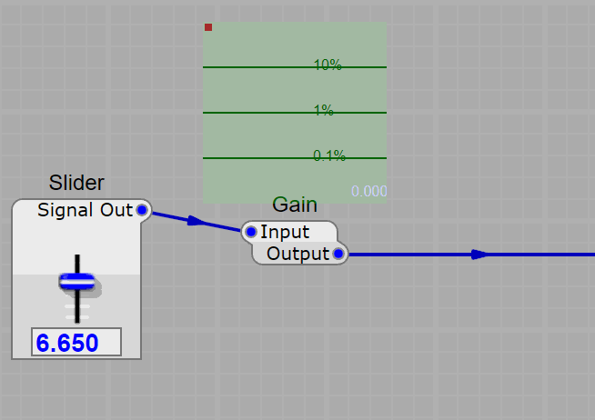

Generalized Music Plugin Interface

In the same vein as VST and Audio Unit plugins, GMPI is a plugin API for Software Instruments and Effects.

The GMPI project was started to gather the best parts of existing specifications and bring them together into an easy to use, open, powerful, and cross-platform alternative to the proprietary standards offered by Steinberg, Apple, and other vendors.

GMPI was instigated by the MMA (MIDI Manufacturers Association) as a collaborative effort. This implementation of GMPI is not endorsed by the MMA, but we've endeavoured to adhere to the specification as closely as is practical.

# Features

GMPI:
* Supports Instruments, Audio Effects, and MIDI plugins
* Has a permissive open-source license (No fees, contracts or NDAs)
* Has cross-platform support
* MIDI 1.0, MPE and MIDI 2.0 support
* Thread-safe by default
* Supports a cross-platform drawing option [GMPI UI](https://github.com/JeffMcClintock/gmpi_ui)
* A clean and bloat-free API surface
* Provides all APIs in pure portable 'C' for maximum compatibility
* Supports sample-accurate automation, tempo and song-position
* VST3 and AudioUnit adaptors are under development.
* Supports plugin latency compensation
* Supports 'silent' buffer optimisations
* Supports musical timing information 
* Supports polyphonic parameters
* Plugin meta-data is plain XML
* Supports 'extensions'. It's easy to add new or DAW-specific features
* Stable, finalized and tested. GMPI has been in active use and refined over 10 years.

# A clean, simple audio plugin API.

Other plugin APIs require a lot of confusing 'boilerplate' code in every plugin. Below are source-code examples which roughly illustrate
 how much overhead is required by other formats compared to GMPI. The plugins are all simple gain plugins. 


GMPI plugins are simply easier to write.  See the full source code of the GMPI gain plugin in [GMPI Plugins/Gain.cpp](https://github.com/JeffMcClintock/GMPI-plugins/blob/main/plugins/Gain/Gain.cpp)

But don't be fooled by the simplicity, even this basic GMPI plugin supports sample-accurate automation. This is because GMPI provides
*sensible default behaviour* for advanced features. Sample-accurate MIDI and parameter automation is *built-in* to the framework. And you can easily override the defaults when you need to.

# Metadata in XML
Rather than writing a lot of repetitive code to describe the plugin, GMPI uses a concise plain text format (XML). This is more future proof than the rigid fixed 'descriptors'
of other plugin APIs, because you can add new features or flags without breaking any existing plugins or DAWs. Here's the description of the example gain plugin...

```XML
  <Plugin id="GMPI Gain" name="Gain" category="SDK Examples" vendor="Jeff McClintock" helpUrl="Gain.htm">
    <Parameters>
      <Parameter id="0" name="Gain" datatype="float" default="0.8"/>
    </Parameters>
    <Audio>
      <Pin name="Input" datatype="float" rate="audio" />
      <Pin name="Output" datatype="float" rate="audio" direction="out" />
      <Pin parameterId="0" />
    </Audio>
  </Plugin>
```
Every plugin has a unique-identifier (the 'id') this can be a URI, a GUID or as in this example, the manufacturer and plugins names. Then the XML lists the plugins parameters, and then its I/O (audio and MIDI input and output channels). A plugin can have any number of audio connections, and any number of MIDI connections. The third pin provides access to the parameter.

# Thread safe by default

With GMPI, all Processor and Editor methods are thread-safe. i.e. the DAW does not ever call GUI components from the real-time thread, or vice versa.
GMPI plugins by default require no locks (e.g. `std::mutex`) and require no atomic values (e.g. `std::atomic`) when communicating between the various components.
This is because the GMPI framework includes a wait-free, lock-free message-passing mechanism. This feature alone eliminates a large
class of common bugs which are found in audio plugins.

# Serialization by default

The GMPI framework provides saving and loading of the plugin state by default. You don't have to provide any 'getStateInformation' or 'setStateInformation' type of methods. It's automatic.

How it works: You describe the parameters and state of your plugin in the XML metadata.
```XML
<Parameter id="0" name="Gain" datatype="float" default="0.8"/>
```
Then associate this data with your plugins variables in the plugin constructor.

```C
Gain()
{
	initializePin(pinGain);
}
```

The GMPI framework will now automatically initialize, save, and load your plugin state from/into that member variable.

If the GUI is closed, the framework updates it the next time it is opened. If the Processor is suspended (due to the silence-detection feature), the GUI will remain 'live' and responsive, because the plugin state is owned by neither the GUI nor the Processor, but shared.

Supported datatypes are: 32 and 64-bit integer and float, bool, std::string, BLOB (any struct composed of plain data types).

# Syncronisation by default

Synchronizing a plugins state between the GUI and Audio thread in other APIs is a common source of bugs and confusion. In GMPI it's simple. Here is how the GUI can update the plugins gain parameter.

```C
pinGain = newParameterValue;
```
That's it. The framework will notify both the host and also the Processor (on the audio thread) of the new value.

And if you want to synchronize a non-atomic datatype with the real-time thread, it's exactly the same:
```C
pinSampleFilenameString = "C:\SomeFolder\SomeSample.wav"; // this is thread-safe
```
(it's a big hassle to synchronize a std::string in other plugin APIs).


# Sample-accurate automation and MIDI by default

The GMPI framework by default parses incoming events and subdivides the audio buffers. e.g. if an event is scheduled half-way through a process-block, the framework will process the first half of the samples, notify the plugin of the event, and then process the remaining samples.

This is why the GMPI samples look so clean and minimal, because the *framework* ensures that events are handled at the right time (and it's easy to override if you prefer to handle events manually).

# Simultaneous parameter changes

A subtle cause of bugs and flaky behaviour in other plugin APIs is the handling of simultaneous parameter changes.
What if two parameters change at the exact same time? Is the API going to notify the Processor one-at-a-time in some random order?
GMPI allows you to detect simultaneous parameter changes and handle them in a deterministic way.

```C
void MidiToCv2::onSetPins()
{
	if (pinVoiceBender.isUpdated() || pinBender.isUpdated() || pinBenderRange.isUpdated())
	{
		// handle any change to the poly or mono note bending in one place.
```

# Silence Detection

Silence flags are a feature to allow plugins to communicate that an audio signal is silent.
The advantage to a plugin is that when its input signal is silent - it may not have to do any work. 

Adding only a few lines of code to our example plugin will enable the silence-flag feature.

```C
	void onSetPins() override
	{
		// Pass through the silence-flag
		pinOutput.setStreaming(pinInput.isStreaming());
	}
```
What this does is communicate to the DAW, that since the input is silent - then so is the plugins output.

Notice how when its input is silent the plugin can choose to completely shut down, using no CPU at all (see below).
This is just one example of how GMPI takes away the drudgery for you by providing *sensible default behaviour* out of the box (which can be customized if you need to).



# Detailed GMPI Specification

[More on the design decisions of GMPI](Docs/FAQ.md) This document explains the design decisions behind GMPI.

[detailed GMPI specs](Docs/GMPI_Specs.md) This is the original specification document which was created by the MMA. It's a bit out of date, but it's still a good reference.

[full working group discussion](https://www.freelists.org/archive/gmpi) This is the original discussion where you can find the rationale behind the design decisions.
