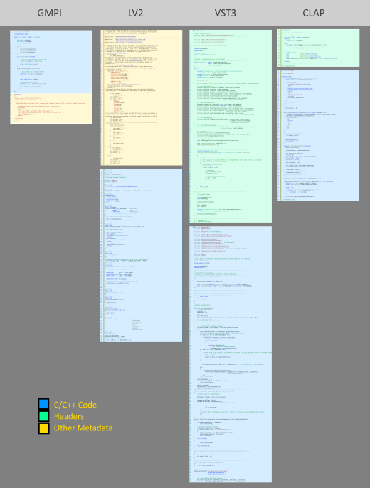

# GMPI
Generalized Music Plugin Interface

In the same vein as VST and Audio Unit plugins, GMPI is a plugin API for Software Instruments and Effects. GMPI was instigated by the MMA (MIDI Manufacturers Association) as a collaborative effort to create an open standard for audio plugins as an alternative to the proprietary standards offered by Steinberg, Apple, and other vendors. This implementation of GMPI is not endorsed by the MMA, but we've endeavored to adhere to the specification as closely as is practical.

# Features

GMPI:
* Supports Instruments, Audio Effects, and MIDI plugins
* Has a permissive open-source license
* Provides all API's in both C++ and in plain 'C'.
* Has cross-platform support
* Supports sample-accurate automation
* Supports plugin latency compensation
* Supports 'silent' buffer optimisations
* Supports musical timing information 
* Supports polyphonic parameters

# A clean, simple audio plugin API.

Other plugin APIs require a lot of confusing 'boilerplate' code just to build a simple plugin. Below you can see some examples of
 a simple gain plugin in various format. The GMPI plugin is simply easier to write.
 But don't be fooled by the simplicity, even this basic GMPI plugin supports sample-accurate automation of it's parameter.

 See the full source code of a GMPI plugin in [Samples/Gain.cpp](Samples/Gain/Gain.cpp)

# Detailed GMPI Specification

[detailed-specs](Docs/GMPI_Specs.md)
